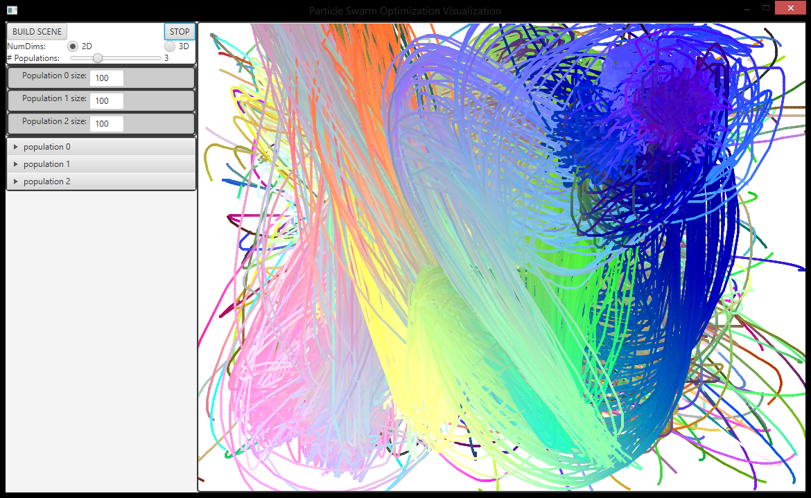

Particle Swarm Optimization Visualization
=================




A Java desktop program for visualizing a basic implementation of the [Particle Swarm Optimization](http://en.wikipedia.org/wiki/Particle_swarm_optimization) search algorithm.

The basic algorithm was created from the pseudocode from [this tutorial](http://www.swarmintelligence.org/tutorials.php).

###Motivation
---
To explore and experiment with ways of visualizing PSO in high dimensional continuous spaces.


###Background / Previous Work
---
A paper that explores high dimensional PSO visualization using Sammon's Mapping:

Kim, Yong-Hyuk, Kang Hoon Lee, and Yourim Yoon. "Visualizing the search process of particle swarm optimization."
Proceedings of the 11th Annual conference on Genetic and evolutionary computation. ACM, 2009.
[PDF](http://cg.kw.ac.kr/kang/visual_pso/visual_pso.pdf)

A paper and project that sonifies the PSO:

Tavares, Tiago F., and Alan Godoy. "Sonification of population behavior in Particle Swarm Optimization."
Proceedings of the 15th annual conference companion on Genetic and evolutionary computation. ACM, 2013.
[PDF](http://www.dca.fee.unicamp.br/~tavares/Swarm/gecco2013.pdf)


###Usage:
---
The PSO algorithm is in the PSO package, and the visualization tools are in the javaFxDriver package.

Compile:
```Shell
javac -d bin src/pso/* src/javaFxDriver/*
```

Run:
```Shell
java -cp ./bin javaFxDriver.Init
```
